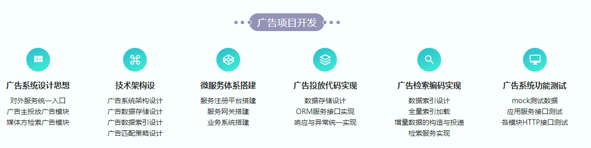
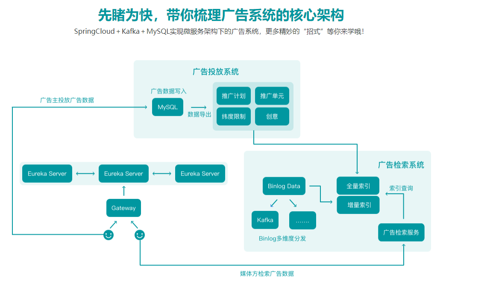

# Spring Cloud 微服务架构设计实现广告系统

## 介绍
从零开始逐步实现广告系统中最为核心的两个模块：广告投放系统与广告检索系统，并测试它们的可用性，在实战中学习广告系统的设计思想，实现方法。

## 软件架构
- Spring Cloud: Greenwich.RELEASE
- zookeeper启动： zookeeper-server-start.bat ../../config/zookeeper.properties
- 数据库：MySQL

## 目录结构
- sponsor： 广告投放服务
- search： 广告检索服务
- dashboard： 服务监控

## 核心架构图
</img>
</img>

慕课网视频地址：https://coding.imooc.com/class/310.html

此项目完成于2019年10月20日