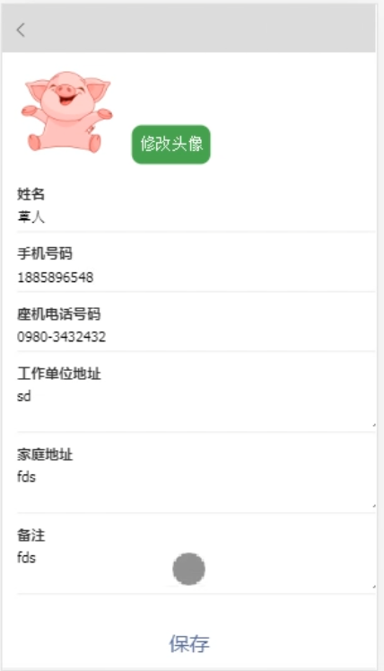

# 通讯录系统

## 介绍
简单的通讯录，前后端分离

## 软件架构
- 开发工具：IDEA、WebStorm
- 前端：Vue2组件化开发、axios，better-scroll
- 后端：Spring Boot + Mybatis、logback日志、druid连接池
- jwt生成token实现前后端分离交互，token定时刷新实现
- webpack项目打包、Spring Boot项目打包发布

## 目录结构
- addressbook-vue：前端
- addressbook：前端后台
- addressbook-admin：管理员端

## 运行效果图
</img>
</img>

此项目完成于2019年11月18日