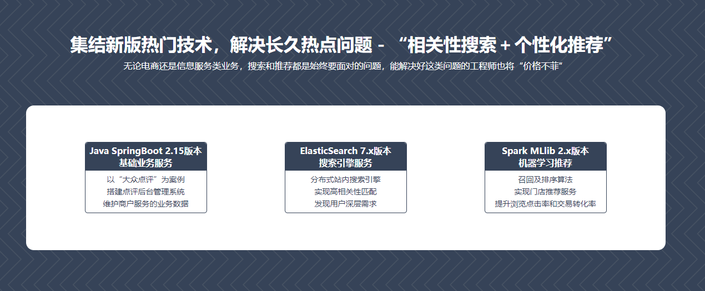
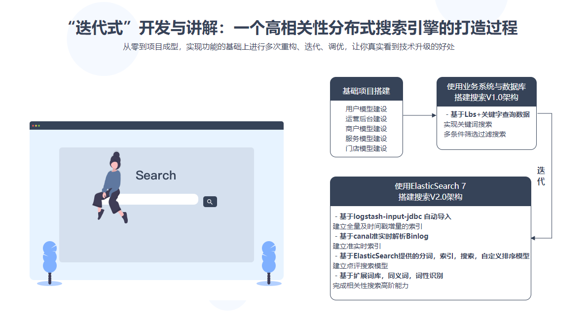
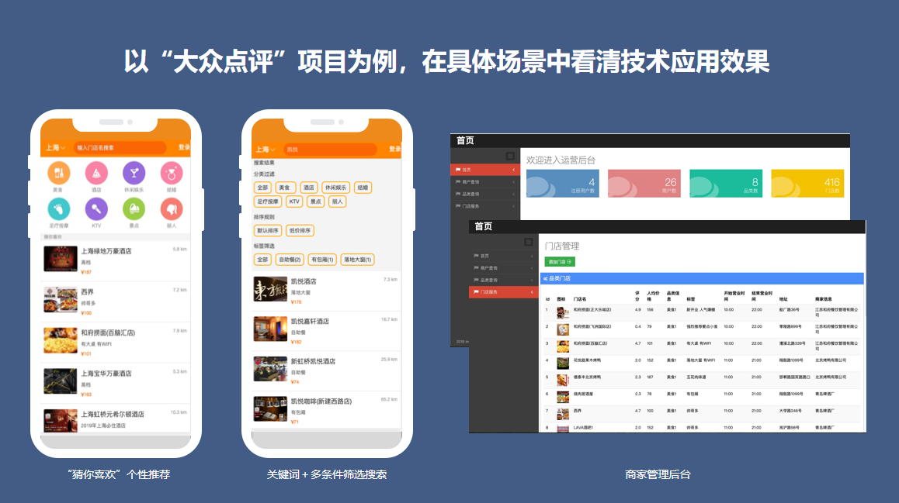

# ES7 + Spark 构建高相关性搜索服务&千人千面推荐系统

## 介绍
基于大众点评搜索以及推荐业务，使用Spring Boot加MyBatis结合前端模板搭建运营后台门店管理功能，借助Elastic Search的最新版本ES7，完成高相关性进阶搜索服务，并基于spark mllib2.4.4构建个性化千人千面推荐系统。

## 软件架构
- Spring Boot 2.15
- Elastic Search 7.x
- Spark MLlib 2.x

## 架构设计图
</img>
</img>
</img>

慕课网视频地址：https://coding.imooc.com/class/391.html

此项目完成于2019年12月18日