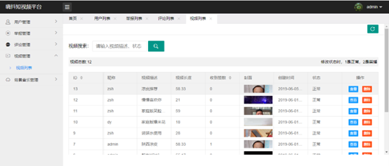
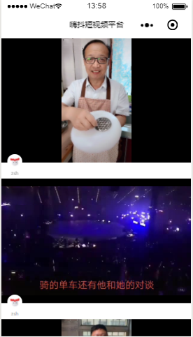

# 嗨抖短视频平台

## 介绍
本系统是基于微信小程序和spring boot2.X 开发的嗨抖短视频项目。
开发说明：本项目基于Java仿抖音项目开发。

## 技术选型
- 核心框架 SpringBoot
- 数据库 MyBatis Plus，Mysql，Druid
- 中间件 zookeeper，redis，swagger2
- 视频处理 FFmpeg
- 前端框架 Bootstrap ，Jquery，LayUI
- 前端分页组件 jqGrid

## 目录结构
hd是后台管理系统的代码，hd_wx是微信小程序的代码

## 运行效果图
</img>
</img>
</img>
</img>

慕课网视频地址：https://coding.imooc.com/class/217.html

此项目完成于2019年6月6日

