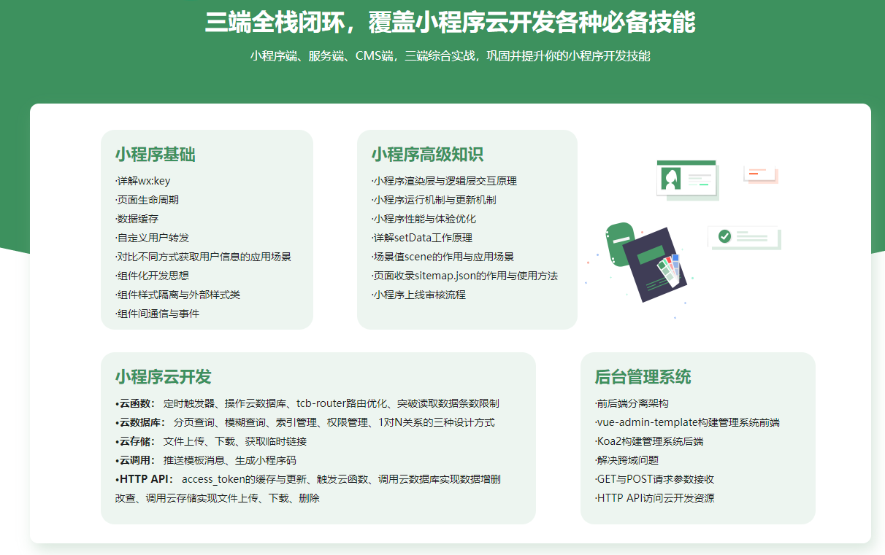
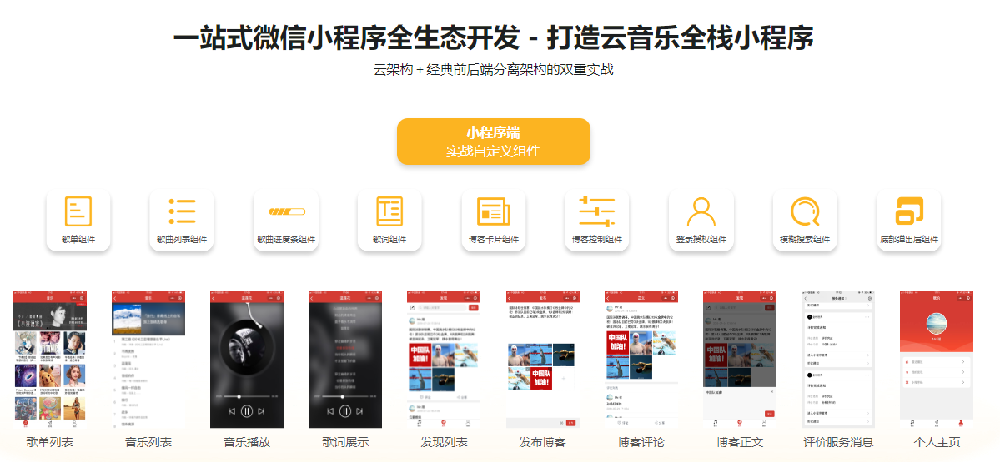
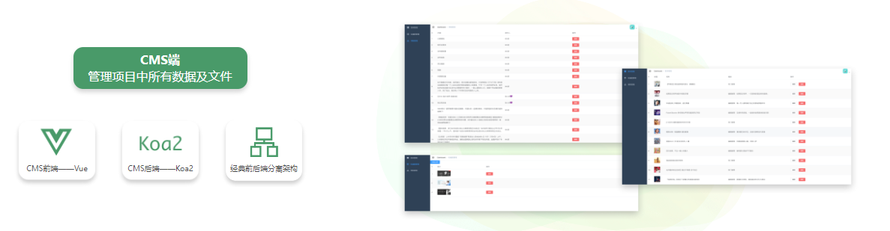

# 嗨乐播放器软件

## 介绍
基于微信小程序开发，调用网易云接口。小程序云开发小程序后端部分，配套后台管理系统连接小程序云数据库及云存储，实现项目数据管理。

## 软件架构
- 小程序基础库 2.7.2
- Vue 2.6 + koa 2
- Node js 8

## 目录结构
- hy-music 是微信小程序的源码
- hy-music-admin-frontend 是小程序管理系统的前端代码
- hy-music-admin-backend 是小程序管理系统的后端代码

## 架构设计图
</img>
</img>
</img>

慕课网视频地址：https://coding.imooc.com/class/373.html

此项目完成于2019年11月28日