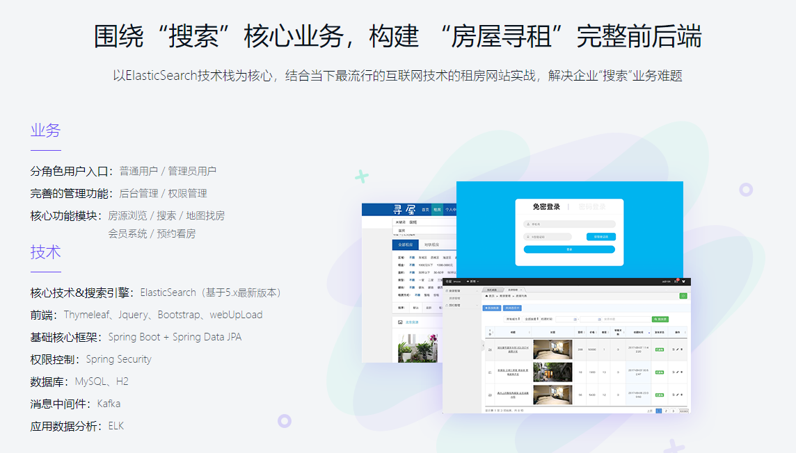
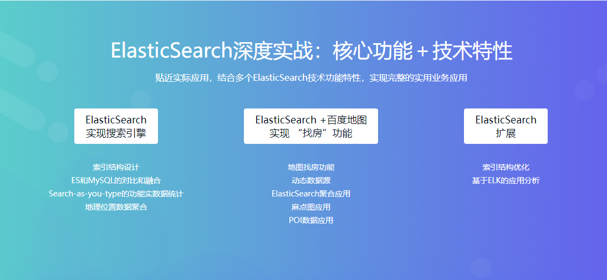

# 海屋搜房平台

## 介绍
数据检索、数据分析等产品异常火爆，而ElasticSearch是当下最火的分布式搜索引擎及大数据分析中间件。了解并掌握ElasticSearch的实用场景及相关技能 ，必将提升互联网行业的核心竞争力，获得更多机会！ 以ElasticSearch技术栈为核心，结合当下最流行的互联网技术的租房网站实战，解决企业“搜索”业务难题。

## 软件架构
- 核心技术&搜索引擎：ElasticSearch（基于5.x最新版本）
- 前端：Thymeleaf、Jquery、Bootstrap、webUpLoad
- 基础核心框架：Spring Boot + Spring Data JPA
- 权限控制：Spring Security
- 数据库：MySQL、H2
- 消息中间件：Kafka
- 应用数据分析：ELK

## 核心架构图
</img>
</img>

慕课网视频地址：[https://coding.imooc.com/class/167.html](https://coding.imooc.com/class/167.html)

此项目完成于2019年9月6日