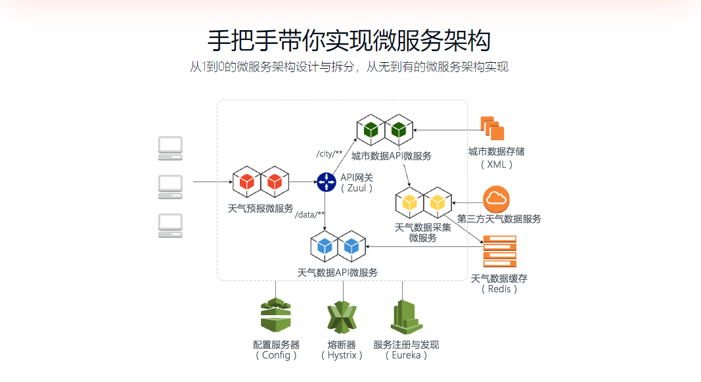
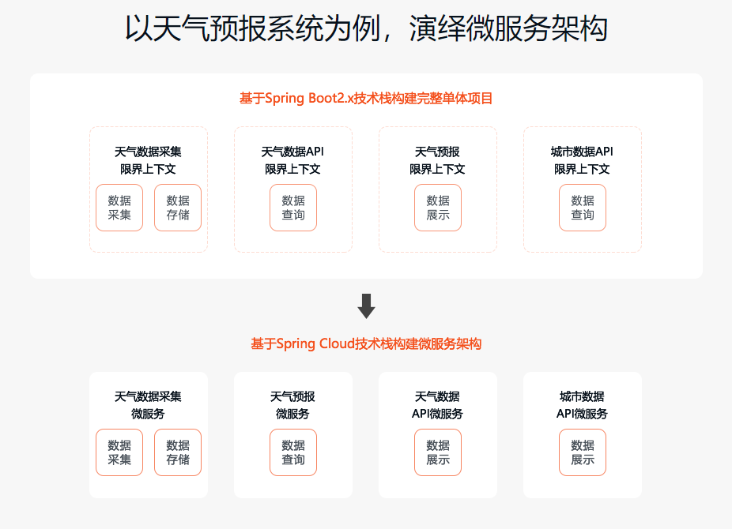

# 从天气项目看 Spring Cloud 微服务治理

## 介绍
天气微服务项目是用来实时的给用户带来天气预报，天气微服务项目可以提供近来几天的天气情况，也提供外出气候等资源，为用户考虑，也有适合如何出行等建议，其天气数据覆盖大多数地理位置的天气情况。

## 天气预报项目微服务
- 天气数据采集微服务
- 天气数据API微服务
- 天气预报微服务
- 城市数据API微服务

## 软件架构
- SpringBoot：2.1.4.realease
- SpringCloud：Finchley.RELEASE
- XML解析：JABX
- JSON序列化:Jackson
- 定时器：Quartz Scheduler
- 网关：Zuul
- 服务注册与发现：EurekaServer、Eureka Client
- 服务交互：RestTemplate、Apache HttpClient
- 服务消费：Ribbon、OpenFeign
- 负载均衡：Ribbon
- 配置中心：Config Server、Config Client
- 服务熔断：Hystrix
- 前端：Thymeleaf
- 前端样式：Bootstrap API
- 数据处理： Redis3.2.1天气数据缓存处理

## Spring Cloud子项目介绍
- Spring Cloud Config 配置中心，利用git来集中管理程序的配置
- Spring Cloud Netflix 集成众多Netflix的开源软件， 包括Eureka、Hystrix、Zuul、Archaius等
- Spring Cloud Bus 消息总线，利用分布式消息将服务和服务实例 连接在一起，用于在一个集群中传播状态的变化，比如配置更改的事件。可与Spring Cloud Config联合实现热部署。
- Cloud Foundry 利用Pivotal Cloudfoundry 集成你的应用程序。CloudFoundry 是VMware 推出的开源PaaS云平台。
- Cloud Foundry Service Broker 为建立管理云托管服务的服务代理提供了一个起点。
- Cluster 基于Zookeeper、Redis、Hazelcast、Consul实现的领导选举和平民状态模式的抽象和实现。
- Consul 基于Hashicorp Consul 实现的服务发现和配置管理。
- Security 在Zuul代理中为Oauth2 REST客户端和认证头转发提供负载均衡
- Sleuth 适用于Spring Cloud 应用程序的分布式跟踪，与Zipkin、HTrace和基于日志（例如ELK）的跟踪相兼容。可以日志的收集。
- Data Flow 一种针对现代运行时可组合的微服务应用程序的云本地编排服务。易于使用的DSL、拖放式GUI和REST API一起简化了基于微服务的数据管道的整体编排
- Stream 一个轻量级的事件驱动的微服务框架来快速构建可以连接到外部系统的应用程序。使用Apache Kafka或Rabbit MQ在Spring Boot应用程序之间发送和接收消息的简单声明模型。
- Steam App Starters 基于Spring Boot为外部系统提供Spring的集成。
- Task App Starters 是Spring Boot应用程序，可能是任何进程，包括Spring Batch作业，并可以在数据处理有限的时间终止。
- Amazon Web Services 与Amazon Web Services 轻松集成。它提供了一种方便的方式与AWS提供的服务进行交互，使用众所周知的Spring惯用语和API（如消息传递或缓存API）。开发人员可以围绕托管服务构建应用程序，而无需关心基础设施或维护工作。
- Connectors 便于PaaS 应用在各种平台上连接到后端像数据库和消息服务。
- Starters 基于Spring Boot的项目，用于简化Spring Cloud 的依赖管理。该项目已经终止，并且在Angel.SR2后的版本和其他项目合并。
- CLI 插件用于在Groovy中快速创建Spring Cloud组件应用程序
- Contract 是一个总体项目，其中包含帮助用户成功实施消费者驱动契约（Consumer Driven Contract）的解决方案。

## 核心架构图
</img>
</img>

慕课网视频地址：https://coding.imooc.com/class/177.html

此项目完成于2019年7月7日

